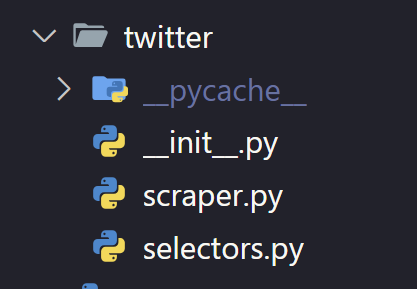

# web automation tooling

#### This repository is loosely based on the article [Why I Hate Page Object Model](https://medium.com/@itayzohar/web-automation-why-i-hate-page-object-model-70abe82beae1)

## Concepts

- **Selector**: A selector is a spacial object that represents an element on the screen.
  To define a selector, you need to provide a way to locate the element.
  Once defined, you can simply call the selector to get the element, and intercat directly with it.

- **driver**: The driver is the object that controls the browser.
  You need a driver to open a browser, navigate to a page, and create selectors.

## User Guide

Let's say we want to automate the login process on twitter.
The reccomended way to do this is to:

1. Create a `Selectors` file, where you define all the selectors you need.
2. Create a `Scraper` file, where you use the selectors to perform actions.

### example

#### Folder structure



#### Code

```python
# ----------- Selectors.py --------
# SelectorFactory is used to create selectors
from web_automation import SelectorFactory

# The "alias" you provide is used to reference the driver. you should use the same alias as long as you want to use the same browser.
factory = SelectorFactory(driver_alias="twitter_driver")


# Define selectors
regular_login_button = factory.by_css('a[href="/login"')
username_input = factory.by_xpath('//span[contains(text(), "username")]/../../..//input')
password_input = factory.by_xpath('//span[contains(text(), "Password")]/../../..//input')

# ----------- Scraper.py --------
from web_agent import get_driver
from Selectors import *

def login(username, password):
    """login to twitter
    Precondition: tweeter main page"""
    regular_login_button().click()
    username_input(wait=6).send_keys(username)
    next_button().click()
    password_input().send_keys(password)
    login_button(wait=6).click()


def scrape():
    """
    login to twitter
    """
    # gets the driver
    driver = get_driver(refresh=refresh)
    driver.get(tweet_url)
    login(username, password)

# ----------- main.py --------
from twitter import scraper
scraper.scrape()

```

### Configuration

define a `webagent-config.json` file in the root of your project.

```json
{
  "webdriver": {
    "url": "http://localhost:9515"
  },
  "waiting": {
    "timeout": 3,
    "sleep_time": 0.2,
    "implicit_wait": 0.2
  }
}
```
